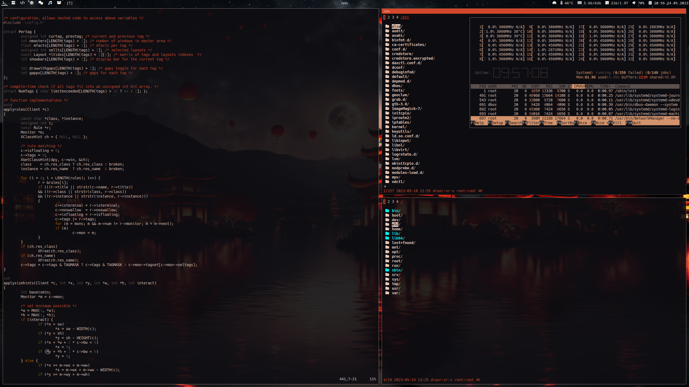

# Personalized ST Fork

This repository contains a personalized fork of ST (Simple Terminal), with patches and customizations applied to enhance its functionality and appearance

Feel free to explore and adapt this customized ST fork to suit your own preferences and requirements.

## Screenshot



## Applied Patches

- `alpha-osc11`: Adds alpha channel transparency support and OSC 11 escape sequence handling.
- `anysize`: Allows resizing the terminal window to any size.
- `boxdraw_v2`: Enhances box drawing characters and improves their rendering.
- `ligatures-boxdraw`: Enables ligatures for box drawing characters.
- `glyph-wide-support-boxdraw`: Adds wide glyph support for improved rendering of certain characters.
- `xresources`: Enables reading color settings from the X resources database (xrdb).

## Installation

1. Clone the repository to your local machine.
   ```shell
   git clone https://github.com/AkamQadiri/st
   ```

2. Compile and install ST by running the following command within the cloned repository:
   ```shell
   sudo make clean install
   ```